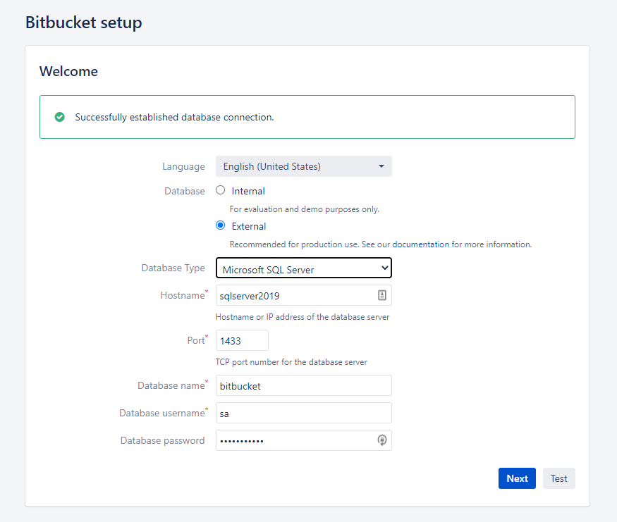

# bitbucket-sql-server

## Getting started

```cli
docker-compose up -d
```

### SQL Server 2019

Connect to the container and create the database:

```cli
docker exec -it sqlserver2019 /bin/sh
```

```cli
/opt/mssql-tools/bin/sqlcmd -S localhost -U SA -P "Password01." -Q 'CREATE DATABASE bitbucket'
```

Verify the db has been created:

```cli
/opt/mssql-tools/bin/sqlcmd -S localhost -U SA -P "Password01." -Q 'SELECT name FROM sys.databases'
name
--------------------------------------------------------------------------------------------------------------------------------
master
tempdb
model
msdb
bitbucket <----- here
```

Bitbucket Server requires a case-sensitive database, but the target database is case-insensitive.

```cli
/opt/mssql-tools/bin/sqlcmd -S localhost -U SA -P "Password01." -Q 'ALTER DATABASE bitbucket COLLATE SQL_Latin1_General_CP1_CS_AS'
```



### Bitbucket server

(In case you want to sping up only Bitbucket server, without using `docker-compose.yml`)

```cli
docker run \
    --rm \
    -v bitbucket-vol:/var/atlassian/application-data/bitbucket \
    --name="bitbucket" \
    -d -p 7990:7990 -p 7999:7999 \
    atlassian/bitbucket-server
```

Bitbucket server will be starting up in http://localhost:7990/
